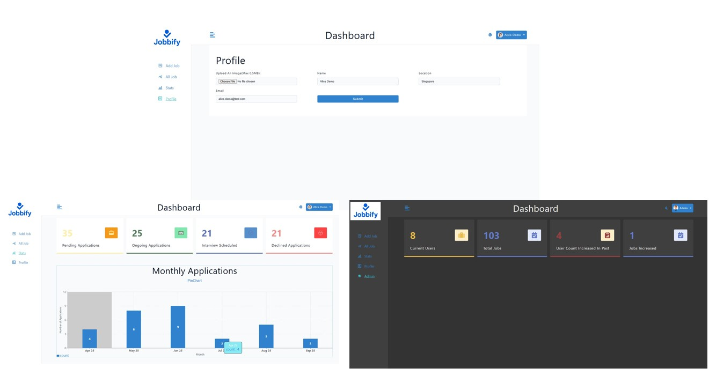
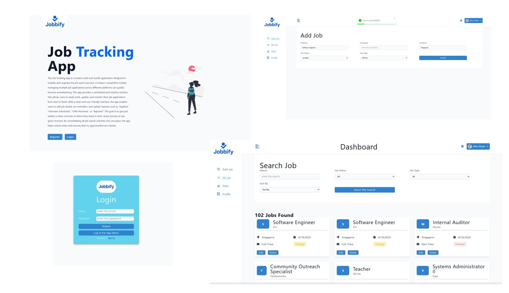

# Job-tracking-project

==========================================================================

## Project Introduction

Project Name: Jobbify, which is a fullstack web application
built using the MERN (MongoDB, Express, React,Nodejs).
The purpose is to help user to manage the job applications and keep the status in track.
It is a project that using the MERN stack(with react-router-dom v7) to build the app with admin dashboard.

## Technologies applied

The technologies applied in this project are:

-   ⠀MERN (MongoDB,Express,NodeJs,React)
-   ⠀Redux Query(Tanstack query)
-   ⠀Styled-component

## Features

&nbsp;Login / Registration / Logout

&nbsp;JobsList / JobDetails / Data Chart

&nbsp;User Profile / EditProfile / uploadImage

&nbsp;Payment with Paypal

&nbsp;Job search / Job filtering

&nbsp;Page pagination

&nbsp;Admin dashboard

&nbsp;Database seeding

&nbsp;Web hosting

## Project Link

&nbsp;Project will be hosted on Render.The link of project demo: [weblink](https://job-tracking-idhm.onrender.com/dashboard).

## What I have learnt

&nbsp; React state management with React-router-dom V7(loader,action)

&nbsp; React & Reduxtoolkit / Query state management

&nbsp; Data Query with MOGODB

&nbsp; Data model design

&nbsp; MVC Model enhancemant

&nbsp; JsonWebToken with cookies for user data cach

&nbsp; Authorization and Authentication

## Future development

-   Add user management / Job management as admin
-   Data Tracking for admin role(The usage of the platform by daily,weekly)
-   Add the user password recovery
-   Resume uploading
